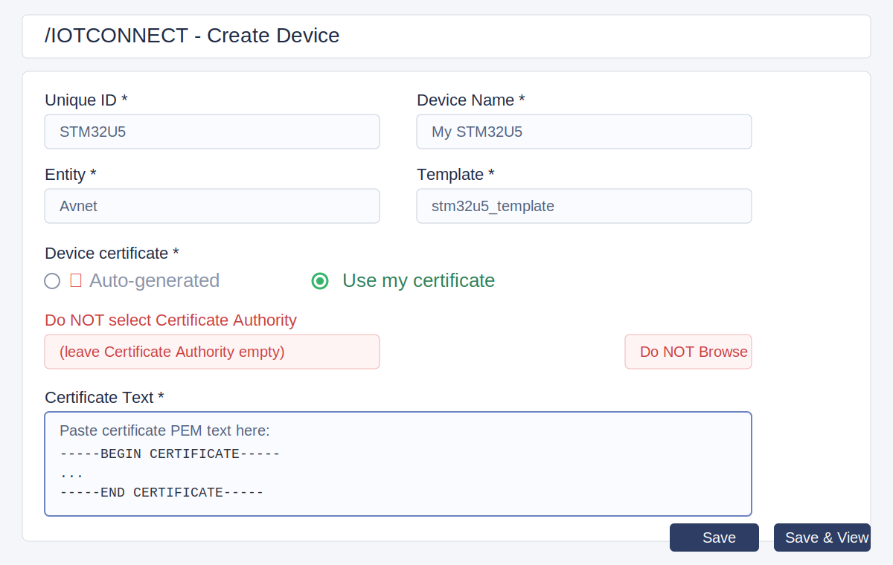
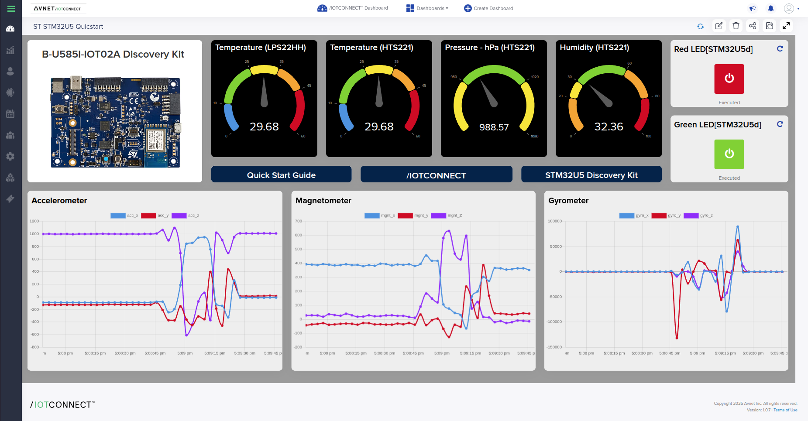

# /IOTCONNECT STM32U5 B-U585I-IOT02A Quickstart

## Introduction

This guide provides a step-by-step flow to program and evaluate the
[B-U585I-IOT02A STM32U5 Discovery kit for IoT](https://www.st.com/en/evaluation-tools/b-u585i-iot02a.html)
with /IOTCONNECT.

## Required Software

- Download the pre-built firmware image:  [b_u585i_iot02a_ntz.bin](https://downloads.iotconnect.io/partners/st/demos/u5/b_u585i_iot02a_ntz.bin)
- Download and install [STM32CubeProgrammer](https://www.st.com/en/development-tools/stm32cubeprog.html).
- Install a serial console application such as [Tera Term](https://ttssh2.osdn.jp/index.html.en) or Minicom (Linux).

## Configure Your Board Serial Console

Open the target board serial port with your terminal application.

Determine the serial port used by the board and configure terminal settings as shown:


On Linux, the board is usually visible as `/dev/ttyACM0` or `/dev/ttyACM1`.

Verify CLI access by entering:

```text
help
```

### Minicom Configuration (Linux)
1. Run `ls /dev/ttyACM*` to find the interface.
1. Run `minicom -D /dev/ttyACM0` (or the detected interface).

## Cloud Account Setup

A /IOTCONNECT account is required.
If needed, create an account using:
[Creating a New /IOTCONNECT Account](https://github.com/avnet-iotconnect/avnet-iotconnect.github.io/blob/main/documentation/iotconnect/subscription/subscription.md)

## Device Setup

### Flash Firmware Image to the Board

1. Open STM32CubeProgrammer.
1. Connect the board to your PC with USB.
1. Open a firmware file:
   - pre-built: `b_u585i_iot02a_ntz.bin`, or
   - locally built: `b_u585i_iot02a_ntz.elf` / `b_u585i_iot02a_ntz.hex`.
1. Click **Download** to program the image.
1. Click **Disconnect** when complete.
1. Press the board reset button.

### Board Variable Configuration

#### Thing Name

Set the device identifier (`duid` / Device ID in /IOTCONNECT):

Command:
```bash
conf set thing_name device_name
```

Expected response:
   - thing_name="device_name"

#### /IOTCONNECT Platform (AWS or Azure)

Set `platform` to `aws` or `azure`:

Command:
```bash
conf set platform aws
```

Expected response:
   - platform="aws"

#### /IOTCONNECT CPID and Env

Set `cpid` and `env` from /IOTCONNECT dashboard **Settings -> Key Vault**:
https://awspoc.iotconnect.io/key-vault

Command:
```bash
conf set cpid cpid_string
```

Expected response:
   - cpid="********************"
   
Command:
```bash
conf set env env_string
```

Expected response:
   - env="env_string"


There are additional settings such as `mqtt_endpoint` and `telemetry_cd`.
These are usually populated by discovery/sync when the device connects.

#### Wi-Fi SSID and Passphrase

Command:
```bash
conf set wifi_ssid ssidGoesHere
```

Expected response:
   - wifi_ssid="ssidGoesHere"


Command:
```bash
conf set wifi_credential MyWifiPassword
```

Expected response:
   - wifi_credential="MyWifiPassword"


#### Commit Configuration Changes

Save staged settings to NVM:

Command:
```bash
conf commit
```

Expected response:
   - Configuration saved to NVM.


### Import CA Certificate

Use:

Command:
```bash
pki import cert root_ca_cert
```

Then paste the certificate content into the terminal.

#### Obtain CA Certificate for AWS

Recommended root CA:
["Starfield Services Root Certificate Authority - G2"](https://www.amazontrust.com/repository/SFSRootCAG2.pem)

#### Obtain CA Certificate for Azure

Recommended root CA:
["DigiCert Global Root G2"](https://cacerts.digicert.com/DigiCertGlobalRootG2.crt.pem)

### Get Public Device Certificate Text

You only need the public device certificate text for /IOTCONNECT Create Device.
Do not create PEM files for this flow.
Do not upload any key for this flow.

If you need to print a device certificate from the board, run:

Command:
```bash
pki generate cert
```

Terminal prompt example:
```text
> pki generate cert

-----BEGIN CERTIFICATE-----
XXXXXXXXXXXXXXXXXXXXXXXXXXXXXXXXXXXXXXXXXXXXXXXXXXXXXXXXXXXXXXXX
XXXXXXXXXXXXXXXXXXXXXXXXXXXXXXXXXXXXXXXXXXXXXXXXXXXXXXXXXXXXXXXX
XXXXXXXXXXXXXXXXXXXXXXXXXXXXXXXXXXXXXXXXXXXXXXXXXXXXXXXXXXXXXXXX
XXXXXXXXXXXXXXXXXXXXXXXXXXXXXXXXXXXXXXXXXXXXXXXXXXXXXXXXXXXXXXXX
XXXXXXXXXXXXXXXXXXXXXXXXXXXXXXXXXXXXXXXXXXXXXXXXXXXXXXXXXXXXXXXX
XXXXXXXXXXXXXXXXXXXXXXXXXXXXXXXXXXXXXXXXXXXXXXXXXXXXXXXXXXXXXXXX
XXXXXXXXXXXXXXXXXXXXXXXXXXXXXXXXXXXXXXXXXXXXXXXXXXXXXXXXXXXXXXXX
XXXXXXXXXXXXXXXXXXXXXXXXXXXXXXXXXXXXXXXXXXXXXXXXXXXXXXXXXXXXXXXX
XXXXXXXXXXXXXXXXXXXXXXXXXXXXXXXXXXXXXXXXXXXXX==
-----END CERTIFICATE-----
```

Copy the certificate text from `-----BEGIN CERTIFICATE-----` through `-----END CERTIFICATE-----` (including both lines).
You will paste this directly into the /IOTCONNECT **Create Device** form.

### Register the Device with /IOTCONNECT

#### 1. Create a Device Template

Use template import instead of manually entering telemetry and commands.

1. Go to `https://awspoc.iotconnect.io/template/1/add`.
1. Select **New Template**, then choose **Import**.
1. Get the template JSON:
   - If you cloned this repo, use `IoTConnect/templates/device-template.json`.
   - If you did not clone, [download `device-template.json`](https://raw.githubusercontent.com/avnet-iotconnect/iotc-freertos-stm32-u5/main-iotc/IoTConnect/templates/device-template.json) (right click and **Save as...**).
1. Upload `device-template.json` in the Import dialog.
1. Click `Save`.

If you must enter values manually, use these telemetry attributes from `device-template.json`:

| Name | Type |
|---|---|
| acc_x | Integer |
| acc_y | Integer |
| acc_z | Integer |
| mgnt_x | Integer |
| mgnt_y | Integer |
| mgnt_Z | Integer |
| gyro_x | Integer |
| gyro_y | Integer |
| gyro_z | Integer |
| temp_1 | Decimal |
| temp_0 | Decimal |
| humidity | Decimal |
| pressure | Decimal |

Use these commands from `device-template.json`:

| Command | Command Name | Parameter Required | Receipt Required | OTA |
|---|---|---|---|---|
| led-green | led-green | Yes | No | No |
| led-red | led-red | Yes | No | No |

#### 2. Register a New Device (Certificate Text Paste)

1. Go to `https://awspoc.iotconnect.io/device/1/add`.
1. Enter `Unique ID` and `Display Name` (typically the same).
1. Select your `Entity`.
1. Select the template created in step 1.
1. Under **Device certificate**, select **Use my certificate**.
1. Paste the certificate text into **Certificate Text**.
1. Do **not** select a **Certificate Authority**.
1. Do **not** click **Browse** for a certificate file.
1. Click `Save & View`.

Reference layout:



### Reset the Target Device

Command:
```bash
reset
```

Expected response:
   - Resetting device.

The device should connect to Wi-Fi and then AWS MQTT using the configured values.

Example connection logs:

```text
<INF>     9574 [MQTTAgent ] Network connection 0x20025538: TLS handshake successful. (mbedtls_transport.c:1367)
<INF>     9574 [MQTTAgent ] Network connection 0x20025538: Connection to xxxxxxxx-ats.iot.us-east-1.amazonaws.com:8883 established. (mbedtls_transport.c:1374)
<INF>     9864 [MQTTAgent ] Starting a clean MQTT Session. (mqtt_agent_task.c:1169)
<INF>    10732 [lwIP      ] Time set to: 2023-10-09T11:56:59.000Z! (time.c:68)
<INF>    10839 [sntp      ] Time received from NTP. Time now: 2023-10-09T11:56:59.000Z! (time.c:100)
```

## Verification

Confirm telemetry in /IOTCONNECT portal:

1. Open *Devices* and select the new device.
1. Open *Live Data*.
1. Confirm telemetry appears after a few seconds.

## Sending Commands

This demo supports controlling red/green LEDs from cloud commands.
Command parameter is required.

Command:
```bash
led-green on
led-green off
led-red on
led-red off
```

## /IOTCONNECT Dynamic Dashboard



Dashboard template file: [dashboard-template.json](https://raw.githubusercontent.com/avnet-iotconnect/iotc-freertos-stm32-u5/main-iotc/IoTConnect/templates/dashboard-template.json)

1. Open /IOTCONNECT and go to Dashboard.
1. Click Import Dashboard and upload the JSON file linked above.
1. Save the imported dashboard and map it to the correct device/template.
1. Open the dashboard in live mode and verify widgets populate from telemetry.

## Erasing Settings (Factory Reset)

Command:
```bash
erase
```

Expected response:
```text
> erase
Erasing QSPI NVM, will reset afterwards.
```
