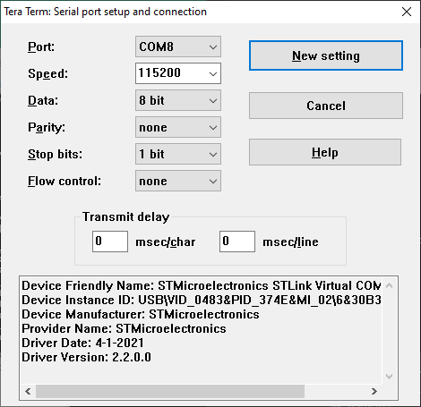

# IoT-Connect STM U5 IOT02 dev kit board demo for AWS

## Introduction

This document provides a step-by-step-guide to program and evaluate the 
[B-U585I-IOT02A STM32U5 Discovery kit for IoT](https://www.st.com/en/evaluation-tools/b-u585i-iot02a.html) board 
on IoTConnect.


## Required Software

* Download the pre-built firmware image from: TBD
* Download and install the [STM32CubeProgrammer](https://www.st.com/en/development-tools/stm32cubeprog.html) for STM32.
* A serial console application, such as [Tera Term](https://ttssh2.osdn.jp/index.html.en) or Minicom on Linux 
 

### Configure Your Board

Open the target board's serial port with your serial console application.

Determine the serial port that the STM32 board is connected to and ensure the following settings
are configured as seen in the screenshot below:



On Linux this device may appear as /dev/ttyACM0 or /dev/ttyACM1.

You will now have access to the command line interface to the device,
enter the command "help" to check that the serial port is functioning.


## Cloud Account Setup
This guide requires an IoTConnect account on AWS.

>**NOTE:**  
> If you have already created an IoTConnect account on AWS, or were provided an account as part of a training or workshop, skip this section.

If you need to create an account, a free 2-month subscription is available.
Please follow the 
[Creating a New IoTConnect Account](https://github.com/avnet-iotconnect/avnet-iotconnect.github.io/blob/main/documentation/iotconnect/subscription/subscription.md)
guide and ensure to select the [AWS version](https://subscription.iotconnect.io/subscribe?cloud=aws) during registration:


## Device Setup

### Flash firmware image onto dev kit board.

Open the STM32CubeProgrammer and plug the U5 board into a a laptop or PC with a
USB cable.  The board should automatically be detected.

Extract the archive containing the firmware images from files.witekio.com, the
images are in several formats.

In STM32CubeProgrammer click the Open File tab or "+" tab at the top of the
window.  In the open file dialog select either of the b_u585i_iot02a_ntz.elf or
b_u585i_io02a_ntz.hex files and click "Open" to load the file.

Towards the top-right of the STM32CubeProgrammer window is a blue "Download" button,
click on this to download the image to the developer kit board.  The red LED
next to the USB socket will flash during the download.

Once the download is reported as complete, click the green "Disconnect" button int
the top-right corner of STM32CubeProgrammer.

Press the black reset button next to the blue button to reset the board.


#### Thing Name

First, configure the desired thing name / mqtt device identifier:

```
> conf set thing_name device_name
thing_name="device_name"
```

#### IoT-Connect CPID and Env

Next, set the IoT-Connect "cpid" and "env" variables.  These can be found on the IoT-Connect web
dashboard under Settings - Key Vault.

```
> conf set cpid cpid_string
cpid = "********************"

>conf set env env_string
env = "env_string"
```


NOTE: There are additional settings for "mqtt_endpoint" and "telemetry_cd".  These should not need
setting as these are obtained by the discovery and sync steps when the device connects to the Internet.
If there are issues, set these to dummy values or obtain from the IoT-Connect dashboard.


#### WiFi SSID and Passphrase

Next, configure you WiFi network details:

```
> conf set wifi_ssid ssidGoesHere
wifi_ssid="ssidGoesHere"

> conf set wifi_credential MyWifiPassword
wifi_credential="MyWifiPassword"
```


#### Commit Configuration Changes
Commit the staged configuration changes to non-volatile memory.

```
> conf commit
Configuration saved to NVM.
```


#### Import the Amazon Root CA Certificate

Use the *pki import cert root_ca_cert* command to import the Amazon Root CA Certificate.

For this demo, we recommend you use the ["Starfield Services Root Certificate Authority - G2](https://www.amazontrust.com/repository/SFSRootCAG2.pem) Root CA Certificate which has signed all four available Amazon Trust Services Root CA certificates.

Copy/Paste the contents of [SFSRootCAG2.pem](https://www.amazontrust.com/repository/SFSRootCAG2.pem)
into your serial terminal after issuing the ```pki import cert``` command.

```
> pki import cert root_ca_cert
```

After pressing enter at the end of the above line, paste the certificate into the terminal.

```
-----BEGIN CERTIFICATE-----
XXXXXXXXXXXXXXXXXXXXXXXXXXXXXXXXXXXXXXXXXXXXXXXXXXXXXXXXXXXXXXXX
XXXXXXXXXXXXXXXXXXXXXXXXXXXXXXXXXXXXXXXXXXXXXXXXXXXXXXXXXXXXXXXX
XXXXXXXXXXXXXXXXXXXXXXXXXXXXXXXXXXXXXXXXXXXXXXXXXXXXXXXXXXXXXXXX
XXXXXXXXXXXXXXXXXXXXXXXXXXXXXXXXXXXXXXXXXXXXXXXXXXXXXXXXXXXXXXXX
XXXXXXXXXXXXXXXXXXXXXXXXXXXXXXXXXXXXXXXXXXXXXXXXXXXXXXXXXXXXXXXX
XXXXXXXXXXXXXXXXXXXXXXXXXXXXXXXXXXXXXXXXXXXXXXXXXXXXXXXXXXXXXXXX
XXXXXXXXXXXXXXXXXXXXXXXXXXXXXXXXXXXXXXXXXXXXXXXXXXXXXXXXXXXXXXXX
XXXXXXXXXXXXXXXXXXXXXXXXXXXXXXXXXXXXXXXXXXXXXXXXXXXXXXXXXXXXXXXX
XXXXXXXXXXXXXXXXXXXXXXXXXXXXXXXXXXXXXXXXXXXXXXXXXXXXXXXXXXXXXXXX
XXXXXXXXXXXXXXXXXXXXXXXXXXXXXXXXXXXXXXXXXXXXXXXXXXXXXXXXXXXXXXXX
XXXXXXXXXXXXXXXXXXXXXXXXXXXXXXXXXXXXXXXXXXXXXXXXXXXXXXXXXXXXXXXX
XXXXXXXXXXXXXXXXXXXXXXXXXXXXXXXXXXXXXXXXXXXXXXXXXXXXXXXXXXXXXXXX
-----END CERTIFICATE-----
```


#### Generate a private key
Use the *pki generate key* command to generate a new ECDSA device key pair. The resulting
public key will be printed to the console.

```
> pki generate key

SUCCESS: Key pair generated and stored in
Private Key Label: tls_key_priv
Public Key Label: tls_key_pub
-----BEGIN PUBLIC KEY-----
XXXXXXXXXXXXXXXXXXXXXXXXXXXXXXXXXXXXXXXXXXXXXXXXXXXXXXXXXXXXXXXX
XXXXXXXXXXXXXXXXXXXXXXXXXXXXXXXXXXXXXXXXXXXXXXXXXXXXXXXXXXX=
-----END PUBLIC KEY-----
```


#### Generate a self-signed certificate
Next, use the *pki generate cert* command to generate a new self-signed certificate.
We will upload this to IoT-Connect as a CA Certificate (Individual) in the next step:

```
> pki generate cert

-----BEGIN CERTIFICATE-----
XXXXXXXXXXXXXXXXXXXXXXXXXXXXXXXXXXXXXXXXXXXXXXXXXXXXXXXXXXXXXXXX
XXXXXXXXXXXXXXXXXXXXXXXXXXXXXXXXXXXXXXXXXXXXXXXXXXXXXXXXXXXXXXXX
XXXXXXXXXXXXXXXXXXXXXXXXXXXXXXXXXXXXXXXXXXXXXXXXXXXXXXXXXXXXXXXX
XXXXXXXXXXXXXXXXXXXXXXXXXXXXXXXXXXXXXXXXXXXXXXXXXXXXXXXXXXXXXXXX
XXXXXXXXXXXXXXXXXXXXXXXXXXXXXXXXXXXXXXXXXXXXXXXXXXXXXXXXXXXXXXXX
XXXXXXXXXXXXXXXXXXXXXXXXXXXXXXXXXXXXXXXXXXXXXXXXXXXXXXXXXXXXXXXX
XXXXXXXXXXXXXXXXXXXXXXXXXXXXXXXXXXXXXXXXXXXXXXXXXXXXXXXXXXXXXXXX
XXXXXXXXXXXXXXXXXXXXXXXXXXXXXXXXXXXXXXXXXXXXXXXXXXXXXXXXXXXXXXXX
XXXXXXXXXXXXXXXXXXXXXXXXXXXXXXXXXXXXXXXXXXXXX==
-----END CERTIFICATE-----
```

Save the resulting certificate to a new file, including the  BEGIN CERTIFICATE and END CERTIFICATE lines.
Name the file as devicecert.pem.


### Register the device with IoTConnect-AWS

1. Upload the certificate that you saved from the terminal, devicecert.pem to the Certificate section of IoT-Connect.
2. Create a template using **CA certificate Individual** as "Auth Type".
3. Create a device and select the certicate that you uploaded in "Certificate Authority" and upload the same certificate again in "Device Certificate".


In the template add attributes for the following, setting their types as integers:

| Name              | Type      |
|-------------------|-----------|
| accelerometer_x   | Integer   |
| accelerometer_y   | Integer   |
| accelerometer_z   | Integer   |
| gyro_x            | Integer   |
| gyro_y            | Integer   |
| gyro_z            | Integer   |


In the template add the following commands that the device supports:

| Command           | Command-Name | Parameter Required | Receipt Required | OTA   |
--------------------|--------------|--------------------|------------------|-------|
| led-green         | led-green    | No                 | No               | No    |
| led-red           | led-red      | No                 | No               | No    |


### Reset the target device

Reset the device and it shall automatically connect to the WiFi router and AWS MQTT broker based
on the configuration set earlier. 

```
> reset
Resetting device.
```

This will take several seconds to connect, There is usually a wait after the filesystem is mounted.
When connected the following lines should appear on the CLI.

```
<INF>     9574 [MQTTAgent ] Network connection 0x20025538: TLS handshake successful. (mbedtls_transport.c:1367)
<INF>     9574 [MQTTAgent ] Network connection 0x20025538: Connection to xxxxxxxx-ats.iot.us-east-1.amazonaws.com:8883 established. (mbedtls_transport.c:1374)
<INF>     9864 [MQTTAgent ] Starting a clean MQTT Session. (mqtt_agent_task.c:1169)
<INF>    10732 [lwIP      ] Time set to: 2023-10-09T11:56:59.000Z! (time.c:68)
<INF>    10839 [sntp      ] Time received from NTP. Time now: 2023-10-09T11:56:59.000Z! (time.c:100)
```

## Verification

At this point the board should be sending telemetry to the IoTConnect portal. We can verify by checking the "Live Data" feed.
* Return to the *Devices* page and click on the newly created Device ID.
* On the left sub-menu, click "Live Data" and after a few seconds, MQTT data should be shown. 


## Sending Commands

This demo supports commands to turn the red and green LEDs on the development kit board on and off.

Send a command "led-green en"  to enable the green LED, set "led-green" to turn green LED off. The same
applies to "led-red en" for the red LED.


## Erasing settings (factory reset)

The settings can be erased with the following command:

```
> erase
Erasing QSPI NVM, will reset afterwards.
```

